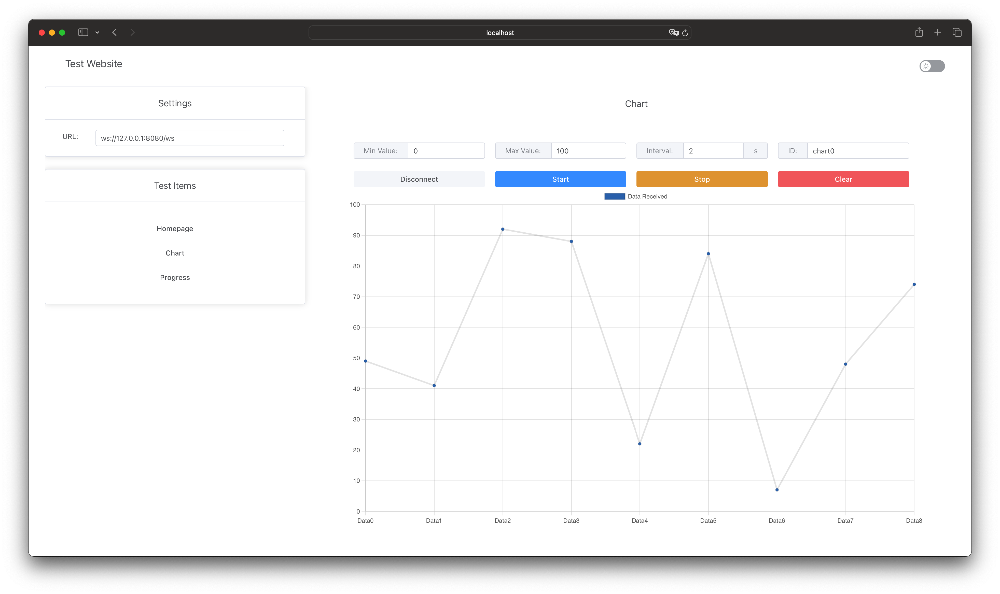

# 2024 Internship Task Example




## Overview

Welcome to the 2024 Internship Task Example repository. This project is designed to showcase your skills in both frontend and backend development. The primary goal is to implement a functional system that demonstrates HTTP and WebSocket communication between the frontend and backend, along with common frontend components.

## Technologies Used

### Frontend (Typescript)

* Vue.js: A progressive JavaScript framework for building user interfaces.
* Vite: A build tool that aims to provide a faster and leaner development experience for modern web projects.
* Element Plus: A Vue 3 based component library for developers, designers, and product managers.
* Vue Chart.js: A wrapper for Chart.js in Vue.
* Vue Router: The official router for Vue.js.
* Pinia: A state management library for Vue.
* Bytebuffer: A JavaScript library for working with binary data.

### Backend (Rust)

* Axum: An ergonomic and modular web framework built with Tokio, Tower, and Hyper.
* Tokio: An asynchronous runtime for the Rust programming language.
* WebSocket: A protocol for full-duplex communication channels over a single TCP connection.
* Prost: A Protocol Buffers implementation for Rust.
* Serde: A framework for serializing and deserializing Rust data structures efficiently and generically.

### Communication

Using ProtoBuf, a method developed by Google for serializing structured data, which is both language-neutral and platform-neutral. It is useful for developing programs to communicate with each other over a network or for storing data.

## Setup Instructions

### Prerequisites

* git
* Node.js (v20)
* yarn (v1.22)
* npx (latest stable version)
* Rust (latest stable version)
* ProtoBuf

### Clone the Repository

```shell
git clone https://github.com/Akiko97/2024-internship-task-example.git
cd 2024-internship-task-example
```

### Building the Application

Simply use `cargo` to compile the backend; the script will automatically compile the proto files and the frontend web pages, then move the compiled static website files to the correct path.

```shell
cargo build -p server --release
```

### Running the Application

```shell
cargo run -p server --release
```

After running the application once, a `server.toml` configuration file will be generated in the root directory. The configuration items in the file have the following meanings:

```toml
host = "localhost" # Host address
port = 8080 # Port number

[http]
base_path = "/" # Base URL path for HTTP
dist_path = "dist" # Directory path for static files to be served

[websocket]
base_path = "/ws" # Base URL path for WebSocket connections

[proxy]
base_path = "/proxy" # Base URL path for the reverse proxy
forward_to = "http://localhost:8080" # Address to which the proxy forwards requests
```

## License

This project is licensed under the MIT License. See the LICENSE file for details.
